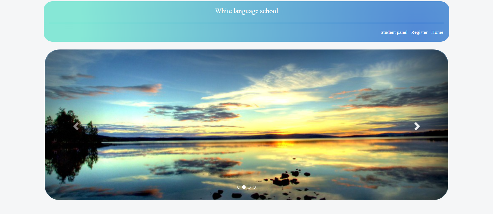
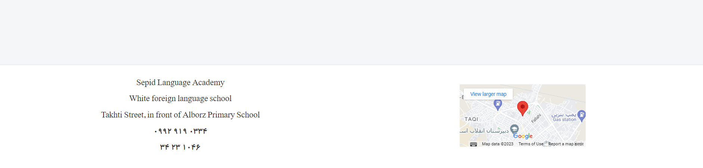
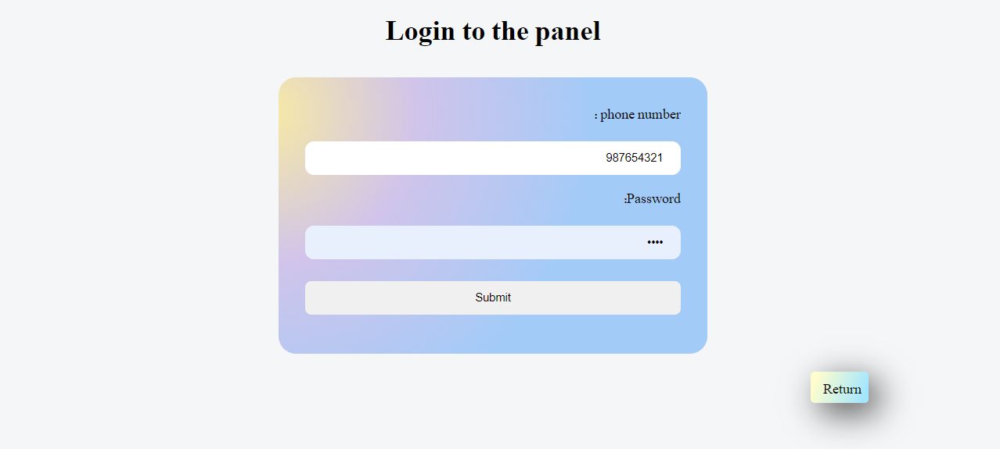
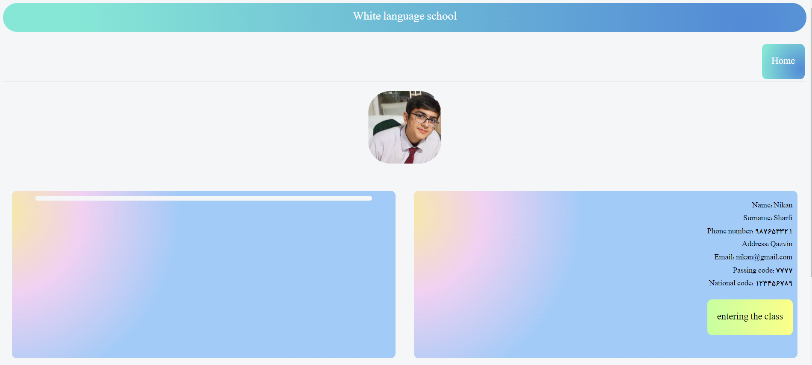
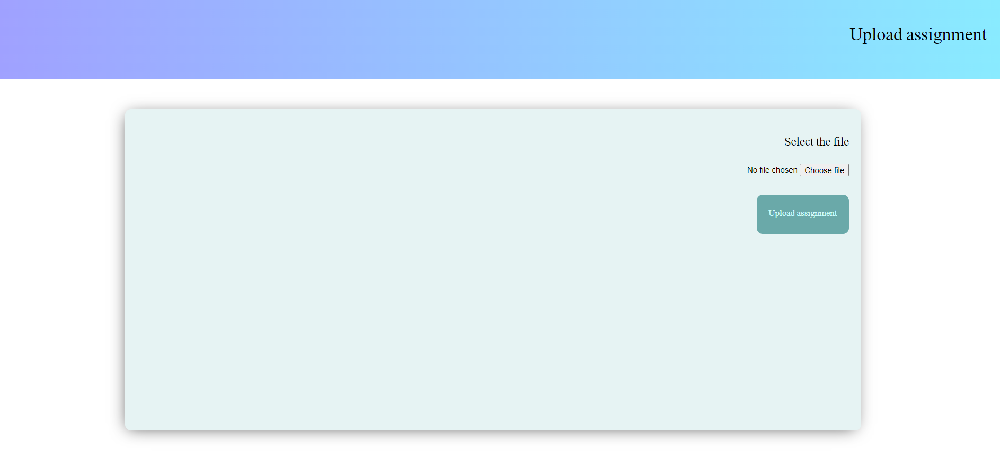
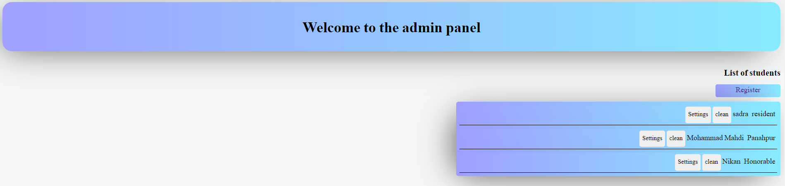

# This is a Learning Management System.
This is a Learning Management System (LMS) designed for schools and institutes. The school administrators can add students and provide them with a link to access their online classes. Students are able to upload homework assignments and set a profile photo, among other features. 
### Important Note: The layout of the website is right-to-left, as it was created for a Persian-English Institute named "White," where Persian is a right-to-left language. In the provided images, the text has been translated to English using Google Chrome's translator, though the original version is in Persian. If you need the English version, please feel free to contact me. Various methods to contact me can be found on my main GitHub page. 

This is the main page that can be customized for your school.

Students can log in using this page.

This is the student panel. Students can view their information and join their classes by clicking the yellow button. On the left side, you can find the homework section where uploaded assignments will be displayed. Homework assignments are visible to the relevant teacher. Additionally, students have the option to choose a profile photo. 

In this page you can upload your homeworks.

This is the admin page for teachers. Teachers can:
* Add or remove students.
* Modify student information, such as names and phone numbers.
* Provide a link for students to access their online classes.
* View homework assignments at domain.com/admin using their username and password.

Thanks for reading!

